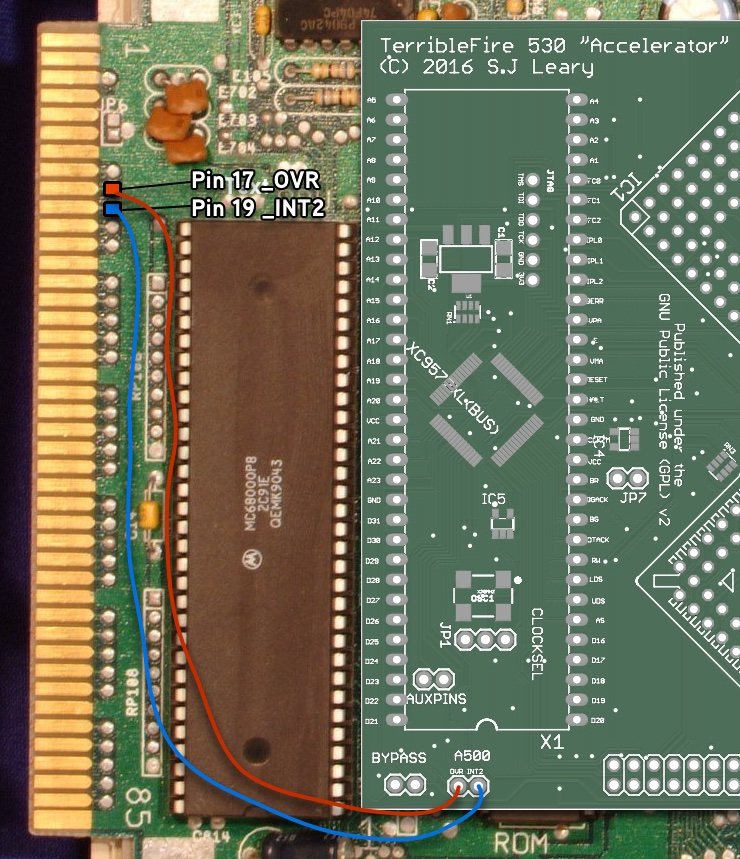

# AI530

** WARNING THIS IS EXPERIMENTAL

This repository is a fork of the [TerribleFire TF530](https://github.com/terriblefire/tf530) accelerator project.

This repository contains all the files needed to produce a copy of the accelerator board.

The CPLD Required is a XC9572XL-10VQ64

Everything in this repository is released under the GNU GPLv2. You may create or base commercial PCBs from the work in this repository but you must make the sources for all derivative work available. 

## Firmware / Requirements

  * Xilinx ISE, 14.7
  * JTAG Adaptor
  * 

[For more information visit the EAB forum thread](http://eab.abime.net/showthread.php?t=85380)

##License

This project and all the files contained are released under the GNU GPLv2. If you build a modified version of the board you must supply the end user with all the sources (this can be a web link).

##The AwesomeInferno 530 board (Revision 2)

This board is in Beta. It may not work in all circumstances but it has been verified to boot AmigaOS 1.3, 2.05 and 3.1 and run various games and desktop apps at 25Mhz. Operation is not guarunteed to be crash free but will work in most "happy path" situations.

The HD interface has only been verified with Compact Flash cards.
The board has been verified booting on Amiga 500 Rev 5, 6a, 8.1a

(DirtyPCBs link removed as the link is now dead.)

No responsibility for any damage to any equipment that results from the use or construction of this board will be accepted. IT IS ENTIRELY AT YOUR OWN RISK!

## Installation

You need to connect the OVR and INT2 signals to the A500 header port as per the diagram below:

## What does the board look like

## The BOM 

| Qty | Value           | Device             | Package              | Parts                                                  | Description                   | 
|-----|-----------------|--------------------|----------------------|--------------------------------------------------------|-------------------------------|
| 1   |                 | MC68030RC          | MPGA128              | IC1                                                    | 68030 PROCESSOR               | 
| 1   |                 | MC68881/2FN-SOC      | PLCC68-S             | IC2                                                    | 6888x CO-PROCESSOR               |
| 1   | 10K             | RESISTOR1206       | 1206                 | R3                                                     | Resistors                     |
| 13  | 10uF            | CAP_CERAMIC1206    | 1206                 | C1, C2, C3, C4, C5, C6, C7, C8, C9, C10, C11, C12, C13 | Ceramic Capacitors            | 
| 2   | 47K             | RESISTOR1206       | 1206                 | R1, R2                                                 | Resistors                     | 
| 2   | 74LVC1G17DBV    | 74LVC1G17DBV       | SOT23-5              | IC4, IC5                                               | Single Schmitt-Trigger Buffer | 
| 1   | A500            | JUMPER-2PTH        | 1X02                 | A500                                                   | Jumper                        | 
| 4   | AS7C4096A-12TIN | AS7C4096A-12TCN    | TSOP44-II            | U$1, U$2, U$3, U$4                                     |                               |  
| 1   | AUXPINS         | JUMPER-2PTH        | 1X02                 | AUXPINS                                                | Jumper                        | 
| 1   | BYPASS          | JUMPER-2PTH        | 1X02                 | BYPASS                                                 | Jumper (optional)           | 
| 3   | CAY16-103J4LF   | CAY16-103J4LF      | RESCAXE80P320X160-8N | RN1, RN2, RN3                                          | Res Thick Film Array 10K Ohm  | 
| 1   | CDIS            | JUMPER-2PTH        | 1X02                 | JP5                                                    | Jumper                        |
| 1   | CLOCKSEL        | JUMPER-3PTH        | 1X03                 | JP1                                                    |                               | 
| 1   | EXT5V           | JUMPER-2PTH        | 1X02                 | JP7                                                    | Jumper                        |
| 1   | IDE CONNECTOR   | PINHD-2X20         | 2X20                 | IDE                                                    | PIN HEADER                    |
| 1   | JTAG            | HEADER-1X6ROUND    | 1X06_ROUND           | JTAG                                                   | PIN HEADER                    |
| 1   | LM1117          | V_REG_LM1117SOT223 | SOT223               | U1                                                     | 3.3V Voltage  Regulator LM1117 |
| 1   | MC68000         | MC68000P           | DIL64                | X1                                                     | 68xxx PROCESSOR SOCKET        | 
| 1   | MMUDIS          | JUMPER-2PTH        | 1X02                 | JP3                                                    | Jumper                        | 
| 1   | SPI PORT        | PINHD-2X6          | 2X06                 | SPIPORT                                                | PIN HEADER                    | 
| 1   | X24MHZ          | OSCILLATOR         | OSC_7X5MM            | OSC1                                                   | 24 Mhz 3.3v oscillator                   |
| 2   | XC9572XL-10VQ64   | XC9572XL-VQ64      | VQ64                 | XC9572XL(BUS), XC9572XL(RAM)                           |                               | 
